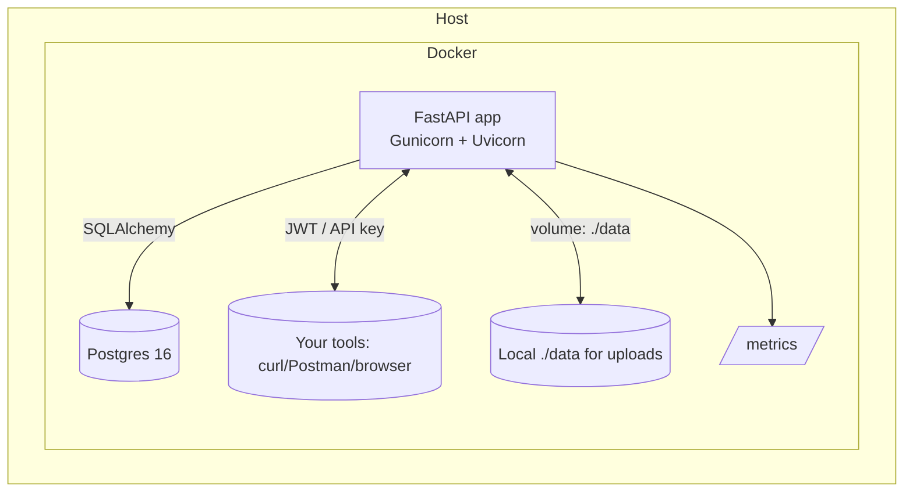

# Learner API Starter (FastAPI + Docker)

[](https://hacktoberfest.com/)


A **self-contained, production-style API** you can run locally with **one Docker command** to learn:
- API design (CRUD, auth, uploads, background tasks, websockets)
- Software testing & inspection (safe-by-default)
- Ops basics (metrics, health checks, rate limiting, CORS)

> ⚠️ For offensive security practice, use purpose-built labs (e.g., OWASP Juice Shop) in a controlled environment. Do **not** target systems you don’t own.

---

## Why this exists

Learners often need a realistic API that:
- boots with one command,
- exposes **all common features** a “real API” has,
- is easy to reset and extend.

This repo provides that: a **complete FastAPI + Postgres** stack with sensible defaults, seed data, and docs.

---

## What’s inside (features)

- **Auth:** JWT bearer tokens + per-user **API keys**, basic **RBAC** (user/admin)
- **CRUD:** `/items` with **pagination**, **filter (`q`)**, **sort**, **PUT/PATCH/DELETE**
- **Files:** upload/download with disk storage (`/data/uploads`)
- **Background tasks** (`/tasks/heavy`)
- **WebSocket** echo (`/ws/echo`)
- **Health** (`/health`) & **Prometheus metrics** (`/metrics`)
- **Rate limiting** (in-memory token bucket) & **CORS**
- **DB:** Postgres + SQLAlchemy ORM
- **Docs:** OpenAPI/Swagger at `/docs`
- **Tests:** pytest scaffold

**Seed users (first startup):**
- `admin@example.com` / `adminpass` (role: admin)
- `user@example.com`  / `userpass`  (role: user)

Authenticate with either:
- `Authorization: Bearer <JWT>` from `/auth/login`, or
- `X-API-Key: <api_key>` (returned on register/login)

---

## One-command start

```bash
docker compose up --build
# then open http://localhost:8000/docs
```

> No `.env` required for local use: production-like defaults are baked in.  
> Data volume: `./data` (mapped to `/data` in the container).

---


## Minimal endpoint tour

| Purpose        | Method & Path                                   | Notes                        |
|----------------|--------------------------------------------------|------------------------------|
| Register       | `POST /auth/register`                            | Returns user + `api_key`     |
| Login          | `POST /auth/login`                               | Returns `{access_token,…}`   |
| Current user   | `GET /whoami`                                    | Auth required                |
| List items     | `GET /items?q=&sort_by=&order=&skip=&limit=`     | Pagination/filter/sort       |
| Create item    | `POST /items`                                    | Auth required                |
| Update item    | `PUT`/`PATCH /items/{id}`                        | Owner or admin               |
| Delete item    | `DELETE /items/{id}`                             | Owner or admin               |
| Upload file    | `POST /files/upload`                             | Multipart                    |
| Download file  | `GET /files/{filename}`                          | Auth required                |
| Echo           | `GET /echo?message=hi`                           | Simple test                  |
| Health         | `GET /health`                                    | Liveness                     |
| Metrics        | `GET /metrics`                                   | Prometheus format            |

Quick auth example:
```bash
# Login to get a token
curl -s -X POST http://localhost:8000/auth/login \
  -H "content-type: application/json" \
  -d '{"email":"user@example.com","password":"userpass"}'

# Use the JWT (replace TOKEN)
curl -H "Authorization: Bearer TOKEN" http://localhost:8000/whoami
```

---

## OS-specific setup

**Prereqs (all OS):**  
- Docker Desktop (macOS/Windows) or Docker Engine + Compose v2 (Linux)

### macOS (Apple Silicon or Intel)
```bash
git clone <your-repo-url> learner-api-starter
cd learner-api-starter
docker compose up --build
# open http://localhost:8000/docs
```

### Windows 10/11 (Docker Desktop + WSL2)
```powershell
git clone <your-repo-url> learner-api-starter
cd learner-api-starter
docker compose up --build
# browse http://localhost:8000/docs
```
> If ports are in use, stop other services on 8000/5432 or edit `docker-compose.yml`.

### Linux (Ubuntu/Debian/Fedora/etc.)
```bash
git clone <your-repo-url> learner-api-starter
cd learner-api-starter
docker compose up --build
# open http://localhost:8000/docs
```

**Troubleshooting (quick):**
- **DNS errors during build** → Configure Docker daemon DNS to `8.8.8.8`/`1.1.1.1`.
- **Proxy/VPN** → export `http_proxy`/`https_proxy` and pass as build args.
- **Ports busy** → change host ports in `docker-compose.yml`.

---

## Local architecture



- **Healthcheck** ensures API waits for DB readiness.
- **Seed** runs once to create admin/user accounts.
- **Uploads** are persisted under `./data/uploads`.

---

## Project layout

```
app/
  api/routes/            # auth, items, files, utils (health, tasks, ws)
  core/                  # settings, security (JWT, hashing)
  db/                    # session, init_db (seed users)
  models/                # SQLAlchemy models (User, Item)
  schemas/               # Pydantic models
  main.py                # app wiring, middleware, metrics
tests/                   # pytest scaffold
Dockerfile
docker-compose.yml
requirements.txt
```

---

## Configuration (defaults)

Most things just work with defaults. Overridable via env vars:

| Var                          | Default                                                                 | Purpose            |
|-----------------------------|-------------------------------------------------------------------------|--------------------|
| `SECRET_KEY`                | random at boot                                                          | JWT signing        |
| `ACCESS_TOKEN_EXPIRE_MINUTES` | `60`                                                                  | Token TTL          |
| `RATE_LIMIT_REQ` / `RATE_LIMIT_WINDOW_SECONDS` | `100` / `60`                                       | Basic rate limit   |
| `POSTGRES_DB` / `USER` / `PASSWORD` | `learner_api` / `learner` / `learnerpwd`                      | DB settings        |
| `DATABASE_URL`              | `postgresql+psycopg2://learner:learnerpwd@db:5432/learner_api`         | SQLAlchemy URL     |
| `DATA_DIR`                  | `/data`                                                                 | Uploads volume     |

To customize, export env vars and `docker compose up` will pick them up.

---

## Testing

```bash
# Run tests inside the API container
docker compose run --rm api pytest -q
```

---

## Extending

- Add new resources in `models/`, `schemas/`, `api/routes/`.
- Add DB migrations (Alembic) if you need schema evolution.
- Plug real queues/caches (e.g., Redis) for tasks and rate limiting.

---

## Reset / teardown

```bash
# stop containers
docker compose down

# also remove volumes (DB data and uploads)
docker compose down -v
```

---

## License

MIT — built for learners. Fork it, break it, extend it. PRs welcome 🚀
